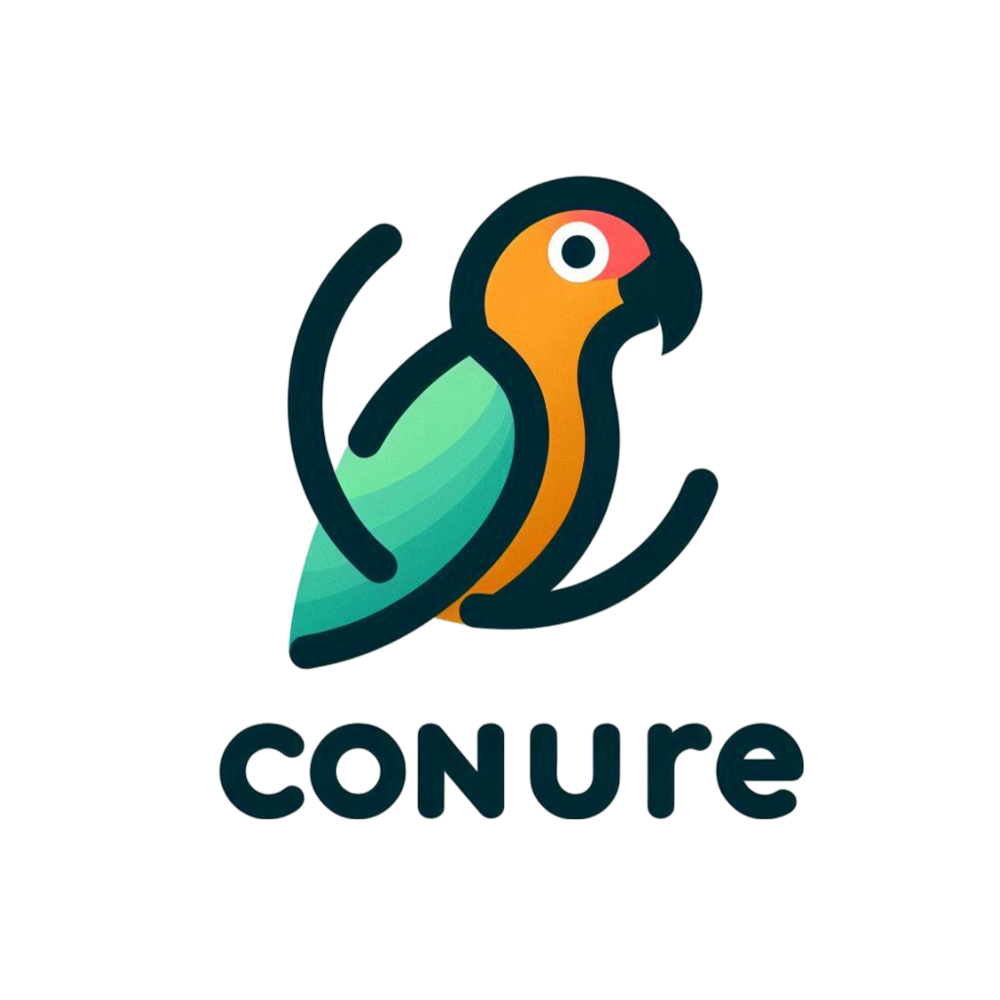
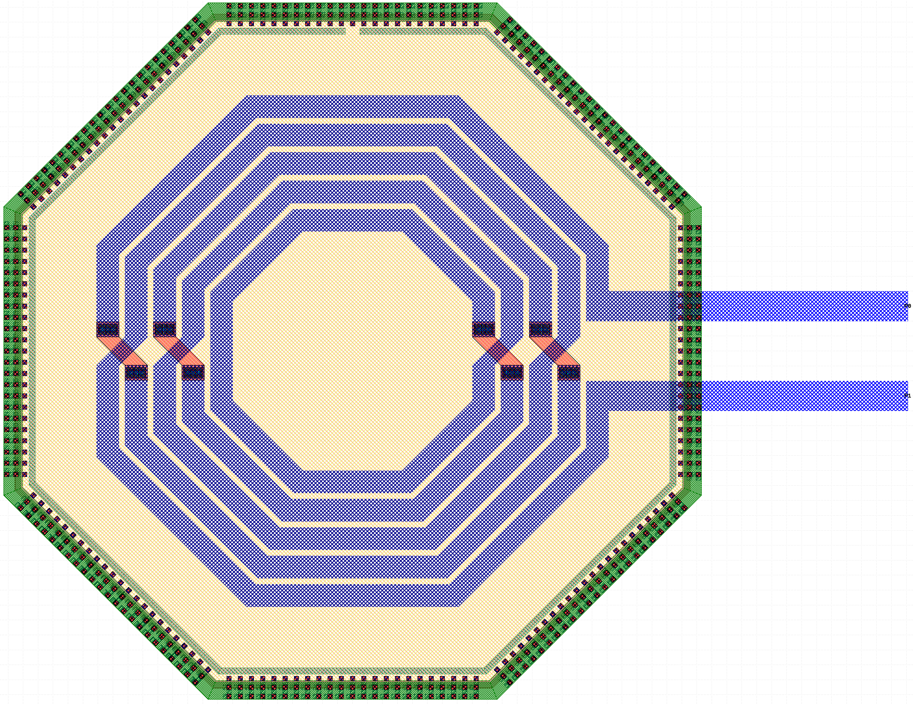
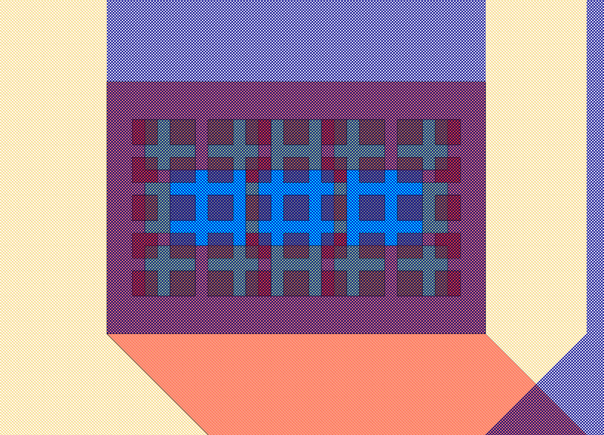
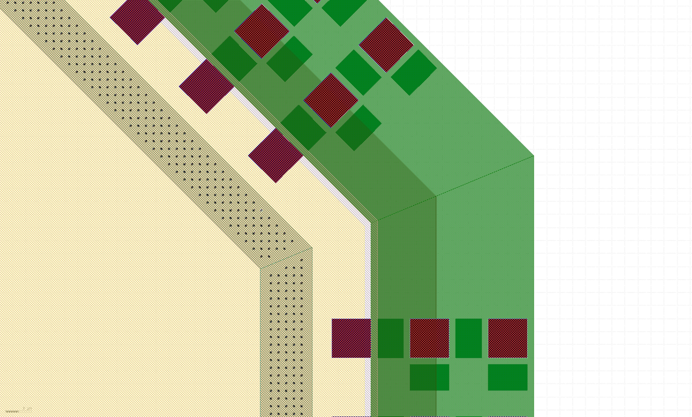
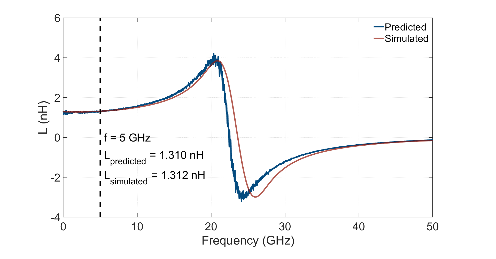
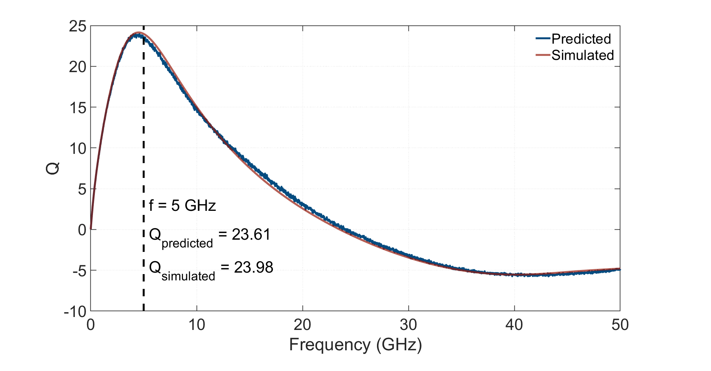
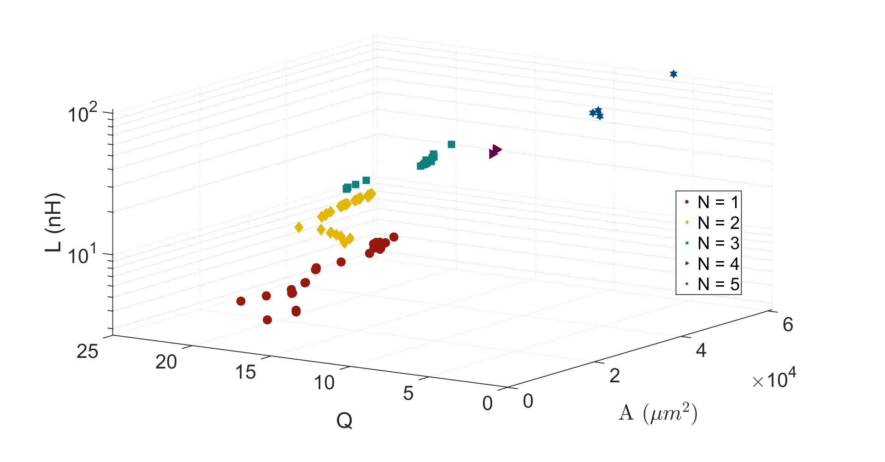
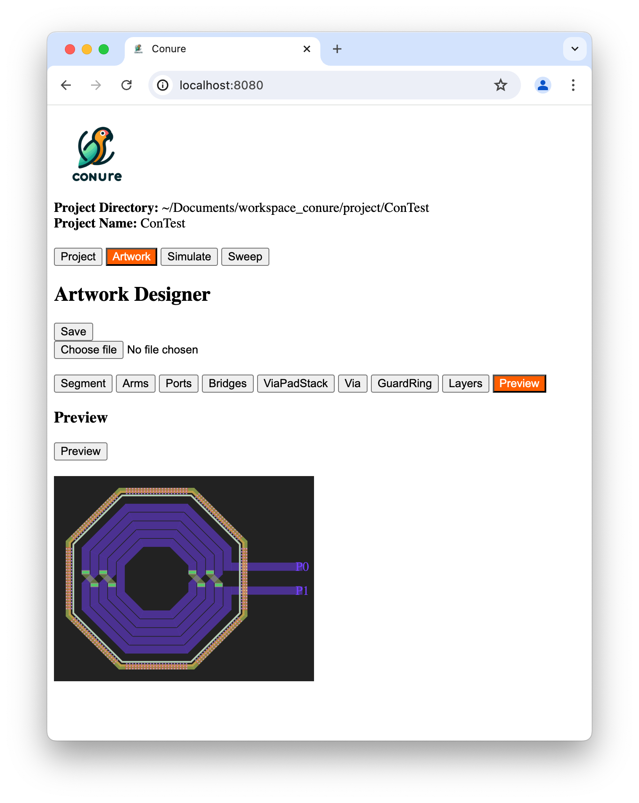

# Conure: Passive Device Artwork Generator, Modelling, and Optimization

Conure is a tool designed to generate inductor artwork and model it using Artificial Neural Networks (ANN) with options for hyperparameter tuning. Our current modeling technique employs ANNs, and the optimization algorithm utilizes NSGA-II. The supported simulator at present is EMX from Cadence.

## Features

- **Artwork Generation**: Easily generate inductor artwork based on provided templates.



- **Via Generation**: Easily create vias for different layers with differnt dimensions and spacing, and automatically fill via area with multiple vias. 




- **Guard Ring Desing**: Take care of all your guard ring layers with appropriate substrate contacts, and dummuy fill on guard rings. (Currently supports checkered dummmuy filling on guard ring)


  
  
- **ANN Modelling**: Model inductors using sophisticated artificial neural networks. 

<div style="display: flex;">
    
    
</div>

  
- **Optimization**: Utilize the NSGA-II algorithm for inductor optimization.



- **EMX Simulation**: Seamlessly simulate using the Cadence EMX simulator.

- **UiX for generating artwork description file**: Create new or load and modify existing artwork description file and generate preview.  



## Work in Progress

- Support for openEMS.

- Additional inductor optimization techniques.
  
- Hot encoding for process technology to be utilized in models.

## Getting Started

Feel free to test out the artwork generator. Example templates for artwork can be found in the `artwork_library` directory.

### Examples

#### Artwork Generation

```bash
$ python artwork_generator/artwork_generator.py -a artwork_library/Inductors/Coplanar/Inductor_Coplanar_5.json -o OUTPUT -n artwork
```

#### EM Simulation

```bash
$ python simulator/simulate.py -f OUTPUT/artwork.gds -c simulator/config.json --sim "emx" -a artwork_library/Inductors/Coplanar/Inductor_Coplanar_5.json -o OUTPUT -n artwork
```

#### Sweep Feature (iterative Artwork Generation with EM Simulation)
```bash
$ python sweep/sweep.py -a artwork_library/Inductors/Coplanar/Inductor_Coplanar_5.json --sweep sweep.json  -o SWEEP_OUTPUT --layout --simulate -c simulator/config.json --sim "emx"
```


## Development Team

- **Habibur Rahman**, University of Oslo, Oslo, Norway
- **Adrian Llop Recha**, University of Oslo, Oslo, Norway 
- **Stefano Fasciani**, University of Oslo, Oslo, Norway 
- **Pål Gunnar Hogganvik**, University of Oslo, Oslo, Norway 
- **Kristian Kjelgård**, University of Oslo, Oslo, Norway 
- **Dag Wisland**, University of Oslo, Oslo, Norway 


## Citation
This tool has been presented as a conference proceeding in the 2024 IEEE International Symposium on Circuits and Systems (ISCAS), Singapore:

*H. Rahman, A. L. Recha, S. Fasciani, P. G. Hogganvik, K. G. Kjelgård and D. T. Wisland, "Conure: Surrogate-based Artwork Generator for RFCMOS Integrated Inductors," 2024 IEEE International Symposium on Circuits and Systems (ISCAS), Singapore, Singapore, 2024, pp. 1-5, doi: [10.1109/ISCAS58744.2024.10558598](https://ieeexplore.ieee.org/document/10558598).* 